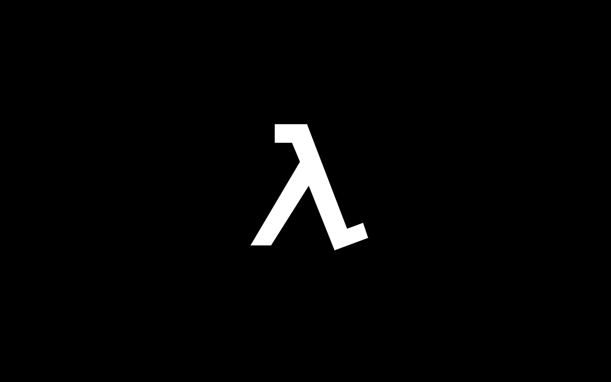

<h1>The motivation</h1>

By the end of 2021, I had been bitten by the crypto bug. It lived at the intersection of many of my interests, and also opened the possibility of creating solutions that could wrest sovereignty away from the oligarchy and back to the people.

Some of the most technologically advanced projects, both within and outside of the blockchain space, turn to functional programming for fault tolerance and scalability, offering superior approaches for handling parallelization and distribution.

**That's exactly my area of interest.** My passion lies in making a real difference in people's lives. I see two paths to achieving this: building products and solutions with tangible impact, and empowering other developers and engineers to do the same.

See what [S909](https://github.com/cipherlogs/s909) can do for you.
